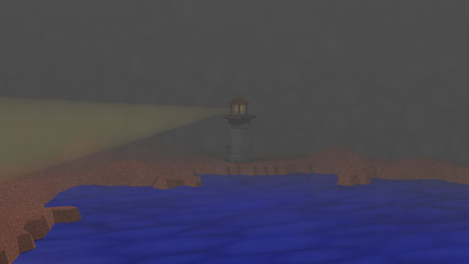
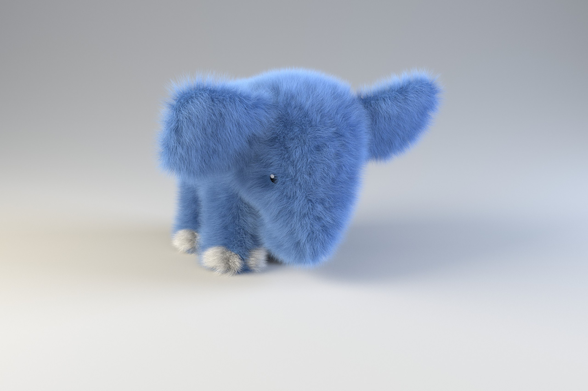

# 2017

In 2017, I became interested in 3D modeling, relocated to Kazan, and met Kate.
But these events are in no way connected with each other.

I got into 3D modeling completely by accident.
I can't draw, but modeling objects was an easy task for me.
I realized that without drawing skills, I can draw!

But this requires an incredible amount of time and patience and quite powerful hardware.

At the beginning of the year, I relocated from Yoshkar-Ola (Republic of Mari El, Russia) to Kazan (Republic of Tatarstan, Russia).
I was attracted to Innopolis - a new city built for the development of IT.
However, it was an MVP (minimum viable product) and very unfinished.
I decided to settle in the capital of the Republic of Tatarstan.

I often visited Yoshkar-Ola, because Kazan is only 150 km away.
And one day I met Kate. I already knew that this was my future wife.

I thought about increasing my income. I started looking for additional work.
And then I created [Meet Aleksey](https://github.com/meet-aleksey).

I was looking for a part-time job in the .NET stack.
But there were few suitable options for me.
And I switched my attention to the PHP stack.

I easily found a part-time job in PHP.

It was a project based on Drupal.
In this project, I independently selected issues for myself in JIRA, solved them, and pushed the results to GitHub.
I was paid for the actual hours I spent resolving issues.

This was the first project where they paid me for my time.
At my day job, I simply received a flat fee every month.

It was difficult for me to account for all the time I spent on work because I was used to selling the result of work, not time.

But it was a really rewarding experience and a new workflow for me.

At Arimsoft, I continued to implement new projects using ASP.NET MVC (Razor), C#, and SQL Server.
I also actively gained frontend skills using TypeScript, SCSS, LESS, as well as Webpack, and many other tools.

I also continued to work on our joint project to implement a unified messaging system with bots support.
In the second half of 2017, we released the first MVP (minimum viable product) of this project.

_Aleksey Nemiro  
2023-09-15_

## Solutions for .NET Framework

:star: [Nemiro.OAuth v1.13](https://github.com/nemiro-net/nemiro.oauth/tree/v1.13)

## Solutions for PHP

:star: [Football simulation](https://github.com/meet-aleksey/php-football-simulation)

---
[< 2016](/2016) &nbsp; **2017** &nbsp; [2018 >](/2018)
