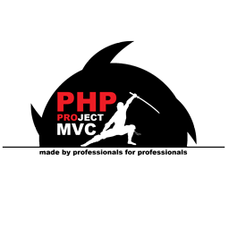
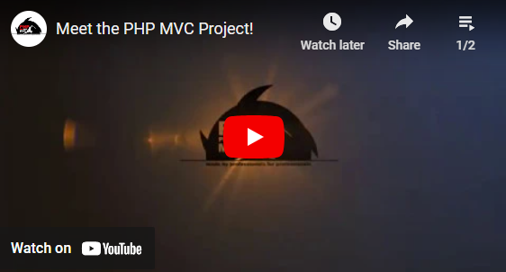

# 2018

2018 was the year of changes.

I continued to look for part-time work in the .NET stack.

But PHP was popular. At some point, I made a [PHP MVC Project](https://github.com/php-mvc-project/php-mvc).

I wrote the code, came up with a logo, made a couple of videos, and wrote a couple of promotional articles.

In fact, in this project, I implemented ASP.NET MVC in PHP.

I also made a couple of Windows Forms (C#) components to fill out the portfolio of my fictional unemployed me - [Meet Aleksey](https://github.com/meet-aleksey).

It sounds strange, but in 12 years of professional programming, I have never been in an interview!

After some time, I received invitations for interviews in the .NET stack.

There were four invitations in total. Even Microsoft was among the companies, which came as a surprise to me.

During technical interviews, they asked strange questions, and sometimes they were forced to write code.
I was completely unprepared for this.

All my communication so far has been exclusively via email. I have never communicated with anyone by voice.
And sharing my screen, which contains confidential information, was something incomprehensible to me.

I didn't pass a single technical interview!
I abandoned this business and continued to work part-time in the PHP stack.

I began to use virtual machines for work.
This way my physical computer was completely clean. All work was done on separate virtual machines.
This approach turned out to be convenient and the security issue began to worry me less.

In the summer of 2018, I was offered another interview in the .NET stack. I refused.
However, HR was persistent and persuaded me to talk.

After that, I went through two technical interviews. And another interview with the CEO.

As a result, I received an offer for the position of Full stack developer in the .NET stack.

That's how I started working at ClearScale.

ClearScale is a fairly large US company that focuses on Amazon Web Services (AWS) technology.

When I started working, I realized that I would have to sell my time!

All work is based on time. Time is money, in the truest sense of the word.

My experience working on a Drupal project where I worked part-time [last year](../2017) helped me a little.

But it was still very difficult for me to adapt. At first, I wasted 50% of my time.

I was working on a legacy project ASP.NET WebForms (C#, and SQL Server) which the company recently took under its wing.

In addition, I got my first experience of code review process and met the QA service.

And there were meetings - countless voice calls.

No one has ever reviewed my code before.
But my code was perfect, so I quickly got used to the code review process.
However, sometimes such a formality slowed down the delivery of the results of my work to the server.

The re-opening of issues by the QA engineers irritated me at first.
Especially when QA engineers found bugs that had nothing to do with the problem I was solving.

But I'm used to this too. If I found bugs in the process of solving a problem, I either fixed them or created separate issues in JIRA. It was easy.
Although not, this required additional time, which I simply did not take into account in my reports.

Reports. There were many of them.

In the summer of 2018, Kate and I relocated from Kazan (Republic of Tatarstan, Russia) to Yoshkar-Ola (Republic of Mari El, Russia).

I also continued to develop the communications platform.
I implemented support for new messaging system providers.
I created widgets for placement on websites. Also, I created a user interface for building dialogues for bots.

_Aleksey Nemiro  
2023-09-15_

## Components for Windows Forms (.NET Framework)

:star: [GradientColorPicker](https://github.com/meet-aleksey/GradientColorPicker)  
:star: [CircleAnglePicker](https://github.com/meet-aleksey/CircleAnglePicker)

## Solutions for PHP

:star: [PHP MVC Project](https://github.com/php-mvc-project/php-mvc)

## Videos

:tv: [Meet the PHP MVC Project!](https://www.youtube.com/watch?v=AvMFHHyhmVM&list=PLx7iAxdP3yHWWIY53ksztN0zqck-r8Wxx)

## Articles

:page_facing_up: [Linked lists](articles/Linked_lists.md)  
:page_facing_up: [User roles in Web applications](articles/User_roles.md)

---
[< 2017](/2017) &nbsp; **2018** &nbsp; [2019 >](/2019)
