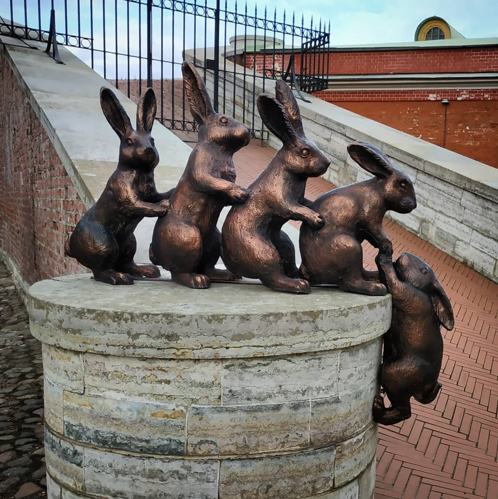
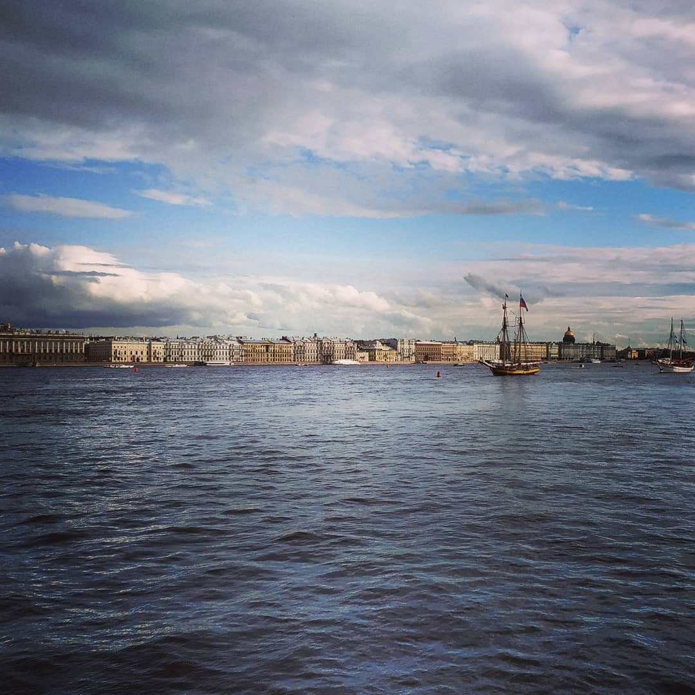

# 2019

2019 was a year of continuous work for me.

I worked 14-18 hours a day. And very often seven days a week.

Of course, I worked in two companies at the same time!

On weekends I tried to spend time with Kate.

We traveled, including to neighboring countries.
It was interesting. But we had a maximum of two days a week, and even then not always.

At ClearScale, we started working on a new project.

This was project ASP.NET Web API, C#, MySql, and then PostgreSQL.
From the frontend side, it was React SPA on TypeScript.

There were about 15 people on our team.

My main task was to set the direction for the development of the frontend part of the project.
I rarely worked with the backend.

It so happened that all the code began to pass through me. I reviewed absolutely all the code.

Colleagues said that I was strict. But I don't agree with them.

I never demanded the impossible from people and often turned a blind eye to minor shortcomings.

It's funny that there was no one to review my code.
However, when I did something big and complex, I asked my colleagues to look at my code.

In the spring, Kate and I relocated from Yoshkar-Ola (Republic of Mari El, Russia) to St. Petersburg (Russia).

This year at Arimsoft I implemented automated deployment using GitLab tools.

It was difficult for me to combine work in two companies and at the end of the year I ended my collaboration with Arimsoft.

During my 14 years at Arimsoft, I was involved in more than fifty projects.

Each subsequent project was more interesting and complex than the previous one.

At Arimsoft, we created incredible things. It was a rewarding experience and a rewarding collaboration!

---

The world was gradually approaching the beginning of the third world war and from somewhere in China news was heard about some kind of virus.

In any unclear situation, go to Karelia (Russia). There is no internet there.

---
Aleksey Nemiro  
2023-09-16
