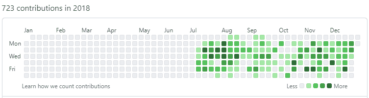
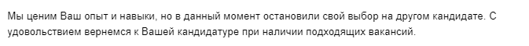
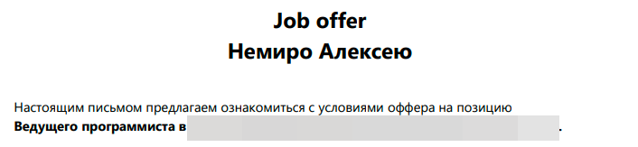

# 2023

2023 was a year of changes.

My collaboration with ClearScale ended at the end of May.

I worked for the company for five years. It's a fact, but during this time I have never been on vacation.
Strictly speaking, in all my seventeen years of commercial development practice, I have never been on vacation.

I decided that it was time for me to remember what summer vacation was.

All summer I have been closely studying development for mobile platforms.

I used **MAUI**, **React Native**, and **Flutter** and released one application on each of these technologies.

And of course, I didn't forget about rest. My wife and I traveled by car around Russia.

At the end of September I started looking for a job.

I was invited to an interview for a C# developer position.
I failed the interview miserably. This is not surprising, because I didn't even prepare for it.
I was just curious to know how interviews go because I have very little experience in this matter.

I decided to take a break and take time to prepare for interviews. But there was one problem.
I'm a programmer and I figured out how to better prepare for an interview. Hell yes, I started writing code!

I received a couple more interview invitations, but by this time I had not yet finished writing the code that would help me pass the interview!
I don't have time to prepare for the interview! This probably sounds strange, but writing code is much more interesting than going through interviews.

However, one of the HR was persistent and persuaded me to have an interview. Why not fail the second interview?

It was a good technical interview, as it should be in reality.
All interview participants were interested in finding out what I know and can do, even if I forgot about it myself.
Although I did not answer all the questions, it was probably clear that my stated programming experience was true.
I received an offer the same day.

I accepted the offer and started working at Finam.

An interesting fact is that this is my first official job in my entire career!

My work was related to web development using ASP.NET Blazor (C#). This was my first experience using Blazor commercially.

I spent the last days of 2023 in the maternity hospital with my wife Kate. On December 31st we had a son.

_Aleksey Nemiro  
2024-05-31_

## Beginning

:baby: Son

## Applications for Android

:star: [RussianPlateCodes](https://github.com/alekseynemiro/russianplatecodes) :ru:  
:star: [Multi-duper Stopwatch](https://github.com/alekseynemiro/multi-duper-stopwatch)  
:star: [TapPlayer](https://github.com/alekseynemiro/tapplayer)

## Articles

:page_facing_up: [What is a Project kit?](https://github.com/alekseynemiro/project-kit)  
:page_facing_up: [Word wrapping issue in HorizontalStackLayout component in MAUI projects](articles/MAUI_HorizontalStackLayout.md)  
:page_facing_up: [How to implement IDisposable in view models in MAUI projects](articles/MAUI_IDisposable.md)  
:page_facing_up: [Реализация IDisposable в моделях представлений в проектах MAUI](articles/MAUI_IDisposable_ru.md) :ru:  
:page_facing_up: [Подпись изменений в Git](articles/Git_GPG_ru.md) :ru:

---
[< 2022](/2022) &nbsp; **2023** &nbsp; [2024 >](/2024)
