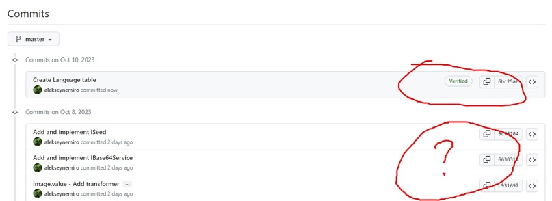
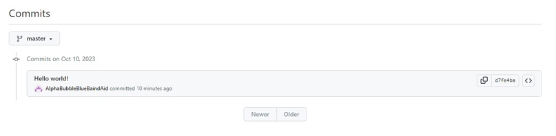
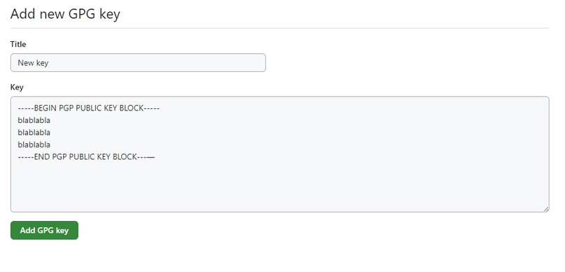

# Подпись изменений в Git

## Введение

Возможно вы обращали внимание, что фиксации изменений в **GitHub** могут иметь флаг **Verified**, который означает, что изменения были сделаны тем пользователем, который был указан при их фиксации.



Обычно флаг **Verified** есть у фиксаций всех **Pull Request**, потому что объединение, как правило, делается через сайт **GitHub**, который может гарантировать, что это сделал конкретный пользователь.

В случае с фиксацией отдельных изменений, по умолчанию, гарантий никаких нет. Любой пользователь имеющий право фиксировать изменения может фигачить их от имени совершенно любых пользователей.
Для этого достаточно указать имя и адрес электронной почты пользователя с помощью следующих команд:

```
git config user.name "Elon Musk"
git config user.email "elon@tesla.com"
```

Если не указывать имя и адрес, то в консоль будут выведены текущие значения.

```
git config user.name
git config user.email
```

Эти параметры хранятся в файле `.git/config`:

```
[user]
name = Elon Musk
email = elon@tesla.com
```

Чтобы посмотреть или изменить глобальные настройки, можно использовать параметр `--global`.

Забавно, что на адрес электронной почты `elon@tesla.com` в **GitHub** зарегистрирован пользователь с именем **AlphaBubbleBlueBaindAid**:



## Использование подписи

Чтобы получить заветный флаг **Verified** у каждой фиксации, их нужно подписывать. Делается это довольно просто.

Я будут использовать **Windows**, но в принципе разницы в порядке действий в разных системах особой нет.

1. Устанавливаем **GnuPG**: [choco install gnupg](https://community.chocolatey.org/packages/gnupg)

2. Проверяем версию: `gpg --version`

```
gpg (GnuPG) 2.4.3
libgcrypt 1.10.2
```

3. Генерируем ключи: `gpg --full-generate-key`

До шага ввода имени и адреса электронной почты можно просто нажимать на **ENTER**.
Но я, например, выбрал тип ключа **RSA (sign only)**.

4. Полное имя пользователя - я обычно использую имя, которые указано у меня в профиле **GitHub**, хотя скорее всего это не имеет значения.

5. **Email пользователя - ВАЖНО указать адрес, который привязан к вашей учетной записи в GitHub: https://github.com/settings/emails**

6. Придумываем и ~~запоминаем~~ записываем куда-нибудь секретную фразу.

7. Получаем идентификатор ключа: `gpg --list-secret-keys --keyid-format=long`.

```
[keyboxd]
-------—
sec rsa4096/A7DA16EA4F7FEFF 2023-10-10 [SC]
1143FFA7EF123456789AF8BC01FBB116A3F71ECC
uid [ ] Elon Musk <elon@tesla.com>
```

В данном случае идентификатор ключа - `A7DA16EA4F7FEFF`.

8. Получаем закрытый ключ по идентификатору: `gpg --armor --export A7DA16EA4F7FEFF`.

9. Копируем в буфер обмена ключ, включая строки `-----BEGIN PGP PUBLIC KEY BLOCK-----` и `-----END PGP PUBLIC KEY BLOCK---—`.

10. Идем на страницу https://github.com/settings/keys и создаём новый ключ (**New GPG key**). Вставляем из буфера обмена содержимое ключа.



11. Идем в репозиторий на локальной машине и говорим, что хотим подписывать все фиксации: `git config commit.gpgsign true`

12. Затем указываем идентификатор ключа: `git config user.signingKey A7DA16EA4F7FEFF`.

13. Пробуем что-нибудь зафиксировать. Если не работает, пробуем указать путь к **GPG**: `git config --global gpg.program 'C:\Program Files (x86)\GnuPG\bin\gpg.exe'`.

В целом, особых проблем с подписью фиксаций возникнуть не должно и если что-то вылезет, то можно найти решение в интернете.

Я обычно делаю индивидуальные настройки для каждого репозитория, но в принципе можно делать глобальные, просто добавляя флаг `--global`, чтобы один раз настроить систему и забывать.
Собственно, я делаю индивидуально, чтобы не забывать, как все это настраивается.

С точки зрения безопасности, желательно всегда подписывать свои изменения, чтобы гарантировать, что они сделаны именно вами.

--
Aleksey Nemiro  
2023-10-10

https://vk.com/@aleksey.developer-github-gpg
