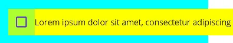
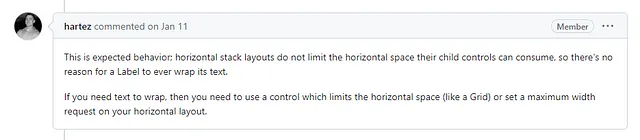
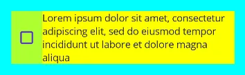
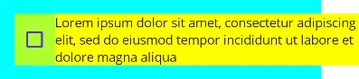
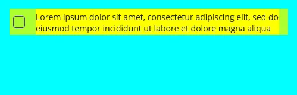
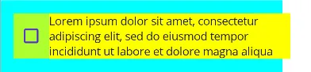
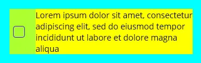

# Word wrapping issue in HorizontalStackLayout component in MAUI projects

During the development of [my first application on MAUI](https://github.com/alekseynemiro/tapplayer), I needed the `CheckBox` component. I was very surprised when I did not find the `Text` property in it. I decided to add text to the `CheckBox` using the `Label` component, and I used the `HorizontalStackLayout` to align the components horizontally. This worked great until I discovered that the text might not fit in the `Label` and was just cropped. Then I just set the `WordWrap` value to the `LineBreakMode` property. But this did not give any results, the text is still cropped. I tried to play around with the layout, but the text was constantly cropping or going beyond the container.

```xaml
<VerticalStackLayout
  Padding="16"
  HorizontalOptions="Start"
  VerticalOptions="Start"
  BackgroundColor="Aqua"
  MaximumWidthRequest="350"
>
  <HorizontalStackLayout
    BackgroundColor="GreenYellow"
  >
    <CheckBox />
    <Label
      Text="Lorem ipsum dolor sit amet, consectetur adipiscing elit, sed do eiusmod tempor incididunt ut labore et dolore magna aliqua"
      LineBreakMode="WordWrap"
      VerticalTextAlignment="Center"
      BackgroundColor="Yellow"
      PropertyChanged="MaximumWidthRequest_PropertyChanged"
    />
  </HorizontalStackLayout>
</VerticalStackLayout>
```

  
*`LineBreakMode` doesn’t work inside `HorizontalStackLayout`.*

I started looking into this problem and it turned out that this behavior of the `HorizontalStackLayout` is normal.

  
*https://github.com/dotnet/maui/issues/10917*

To solve the problem, I decided to try using `Grid`.

```xaml
<Grid
  HorizontalOptions="Start"
  VerticalOptions="Start"
  BackgroundColor="GreenYellow"
  MaximumWidthRequest="350"
>
  <Grid.ColumnDefinitions>
    <ColumnDefinition Width="Auto" />
    <ColumnDefinition Width="*" />
  </Grid.ColumnDefinitions>
  <CheckBox Grid.Column="0" />
  <Label
    Text="Lorem ipsum dolor sit amet, consectetur adipiscing elit, sed do eiusmod tempor incididunt ut labore et dolore magna aliqua"
    LineBreakMode="WordWrap"
    VerticalTextAlignment="Center"
    BackgroundColor="Yellow"
    Grid.Column="1"
  />
</Grid>
```

This is a very simple solution and works great.

  
*Perfect result using `Grid`.*

---

What about `HorizontalStackLayout`? I tried to solve the problem by limiting the width of the component using the `MaximumWidthRequest` property. As a base value, I took the width of the top-level container, to which I added a name to make it easier to find it in the component tree.

```xaml
MaximumWidthRequest="{Binding Source={x:Reference Container}, Path=Width}"
```

This solution will only work correctly if there are no other elements in the `HorizontalStackLayout`. But it doesn’t make any practical sense!

  
*The text wraps but still doesn’t fit in the container.*

Since my first element is a `CheckBox`, I decided to simply subtract its approximate size from the width of the parent container. To do this, I made a converter that expects the width of the parent container as a value, and a subtracted value as an additional parameter.

```c#
internal class SubtractConverter : IValueConverter
{
  public object Convert(object value, Type targetType, object parameter, CultureInfo culture)
  {
    var valueInt = System.Convert.ToInt32(value, CultureInfo.InvariantCulture);
    var parameterInt = System.Convert.ToInt32(parameter, CultureInfo.InvariantCulture);
    var result = valueInt - parameterInt;

    return result;
  }

  public object ConvertBack(object value, Type targetType, object parameter, CultureInfo culture)
  {
    throw new NotImplementedException();
  }
}
```

I just took a random value of 75:

```xaml
<Label
  Text="Lorem ipsum dolor sit amet, consectetur adipiscing elit, sed do eiusmod tempor incididunt ut labore et dolore magna aliqua"
  LineBreakMode="WordWrap"
  MaximumWidthRequest="{Binding
    Source={x:Reference Container},
    Path=Width,
    Converter={StaticResource SubtractConverter},
    ConverterParameter=75
  }"
>
```

And it works! But as it turns out, this only works on **Windows**.

  
*Great job on Windows. Although not accurate enough.*

In **Android**, the component is not re-render for some reason. Moreover, due to the fact that the initial width of the container is minus one, an invisible `Label` with an incredible height is displayed on the screen.

  
*In Android, a Label with a negative width and word wrap takes up the entire height, and for some reason, the CheckBox (green) tries to take up all the space that the Label generated.*

To force the component to re-render, I decided to call the `InvalidateMeasure` method when the value of the `MaximumWidthRequest` property changes.

```c#
protected void MaximumWidthRequest_PropertyChanged(object sender, PropertyChangedEventArgs e)
{
  if (e.PropertyName.Equals(nameof(MaximumWidthRequest)))
  {
    ((IView)sender).InvalidateMeasure();
  }
}
```

But it didn’t give any results. In the debugger, I can see that the code works fine, but the **Android** component still doesn’t re-render. I decided to call `InvalidateMeasure` with the `Dispatch` method, which adds a UI update job to the queue.

```c#
protected void MaximumWidthRequest_PropertyChanged(object sender, PropertyChangedEventArgs e)
{
  if (e.PropertyName.Equals(nameof(MaximumWidthRequest)))
  {
    Dispatcher.Dispatch(((IView)sender).InvalidateMeasure);
  }
}
```

Now in **Android** everything works as intended. Using the `#if` directive, I limited the execution of this code to the **Android** platform only. Although I don’t see any point in it.

```c#
protected void MaximumWidthRequest_PropertyChanged(object sender, PropertyChangedEventArgs e)
{
#if ANDROID
  if (e.PropertyName.Equals(nameof(MaximumWidthRequest)))
  {
    Dispatcher.Dispatch(((IView)sender).InvalidateMeasure);
 }
#endif
}
```

  
*Now in Android everything works as it should. Although 50px turned out to be small, the text still fits into the container and is unlikely to go beyond.*

And while relative size works well, accuracy is better. I made a new converter that can take on many values.

```c#
internal class MultiSubtractConverter : IMultiValueConverter
{
  public object Convert(object[] values, Type targetType, object parameter, CultureInfo culture)
  {
    return System.Convert.ToInt32(values[0], CultureInfo.InvariantCulture)
      - values.Skip(1).Sum(x => System.Convert.ToInt32(x, CultureInfo.InvariantCulture));
  }

  public object[] ConvertBack(object value, Type[] targetTypes, object parameter, CultureInfo culture)
  {
    throw new NotImplementedException();
  }
}
```

The value of the first parameter is expected to be the width of the parent container. The following parameters contain the values that will be subtracted from this width. The number of parameters can be any. In my case, I’m subtracting the width of the `CheckBox` and the horizontal padding of the container.

```xaml
<VerticalStackLayout
  x:Name="Container3"
  Padding="16"
  HorizontalOptions="Start"
  VerticalOptions="Start"
  BackgroundColor="Aqua"
  WidthRequest="350"
>
  <HorizontalStackLayout
    BackgroundColor="GreenYellow"
  >
    <CheckBox
      x:Name="CheckBox"
    />
    <Label
      Text="Lorem ipsum dolor sit amet, consectetur adipiscing elit, sed do eiusmod tempor incididunt ut labore et dolore magna aliqua"
      LineBreakMode="WordWrap"
      VerticalTextAlignment="Center"
      BackgroundColor="Yellow"
      PropertyChanged="MaximumWidthRequest_PropertyChanged"
    >
      <Label.MaximumWidthRequest>
        <MultiBinding Converter="{StaticResource MultiSubtractConverter}">
          <Binding
            Source="{x:Reference Container3}"
            Path="Width"
          />
          <Binding
            Source="{x:Reference Container3}"
            Path="Padding.HorizontalThickness"
          />
          <Binding
            Source="{x:Reference CheckBox}"
            Path="Width"
          />
        </MultiBinding>
      </Label.MaximumWidthRequest>
    </Label>
  </HorizontalStackLayout>
</VerticalStackLayout>
```

This works great. Although of course, this solution is more complicated than when using `Grid`.

  
*Perfect result.*

The source code can be found at the following link:  
https://github.com/alekseynemiro/knowledgebase/tree/master/csharp/maui/MauiHorizontalStackLayoutLineBreakMode

---
Aleksey Nemiro  
2023-06-13

https://medium.com/maui-stories/word-wrapping-issue-in-horizontalstacklayout-component-in-maui-projects-9df559e041b
