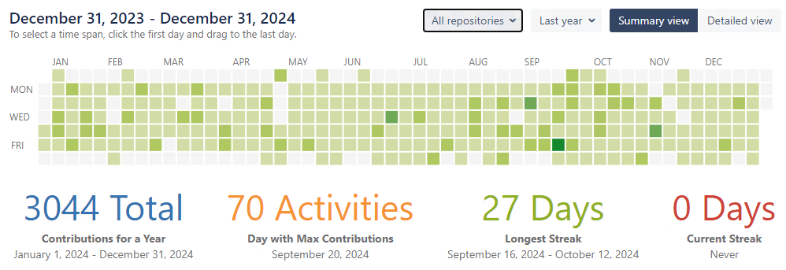

# 2024

2024 was the year of work.

I continued my collaboration with Finam. This was my first full year with the company.

I worked on two projects that I started alone. These were projects on ASP.NET Core Blazor WebAssembly.

One of the projects was released in the middle of the year. The second one was brought to the MVP stage by the end of the year.

I set the course of project development, formed standards, set tasks, planned releases, and maintained documentation.

By the end of the year, our team had grown to four permanent members, and we also periodically brought in people from other teams.

What's interesting is that I tend to become autonomous. In my first year at Finam, I was absolutely autonomous.  
I just had two big tasks that I broke down into stages, and many subtasks for myself and the team.

I was involved in the recruitment process. We checked hundreds of interviews. It boosted my self-esteem a little :)

Since my primary ​​responsibility is front-end development, I created a methodology to screen candidates for JavaScript experience.

I was heavily involved in deployment setup. Worked with Docker. Got a superficial understanding of Kubernetes.

I have released four NuGet packages for internal use.

From time to time, I continue to work on some of my own projects on WASM and React.

_Aleksey Nemiro  
2025-01-02_

---
[< 2023](/2023) &nbsp; **2024** &nbsp; [2025 >](/2025)